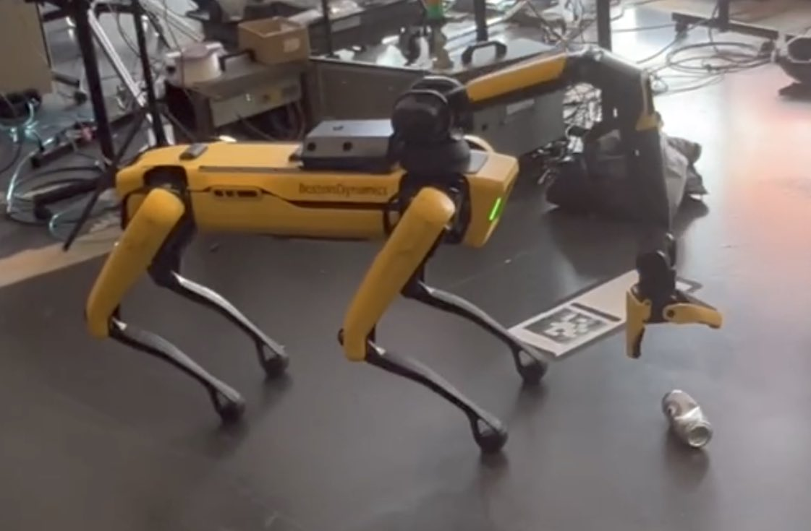
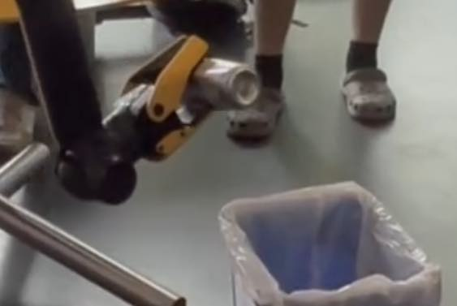
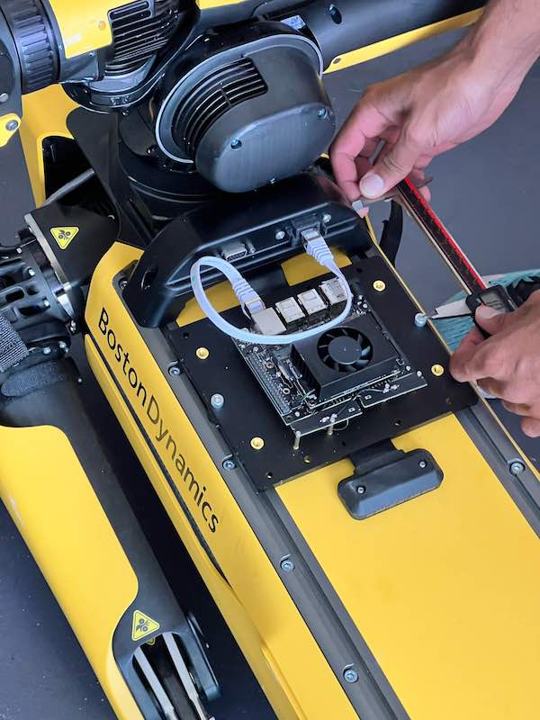

# Quadruped Robot Recycling Soda Cans

Demonstration of using Groundlight SDK to locate soda cans and place them in a recycling bin.

## Notice: Proof of concept only

This code was developed during a summer internship.  It is not production quality, and should not be relied on for real commercial applications.  It is a proof-of-concept and demonstration of capabilities only.

## Application

The robot is programmed to walk a pre-programmed path looking for soda cans on the ground.  The cans are detected using a Groundlight detector.  When identified, the robot carries them to a recycling bin and drops them in.

## SDK running in Groundlight Backpack

This application code runs on a Groundlight Backpack, which houses an NVIDIA Jetson Nano, mounted to the back of the robot.  The Backpack runs the Groundlight SDK, and controls the robot and its camera through an ethernet interface, and talks to the Groundlight API in the cloud over WiFI.

# Instructions

## How to boot up Spot
1. Plug a battery into spot.
2. Hold power button near the back of spot until fans turn on.
3. Connect to Jetson Backpack via "ssh gluser@10.44.2.255". The is ip configured as static. Ask Arya for the password.
4. Type "cas". This is a bash alias for "conda activate spotenv".
5. Type "exps". This is a bash alias for exporting several relevant environment variables.
6. Type "ping "192.168.50.3" and verify that you get an appropriate response from the robot.

## How to run can recycle demo
1. Navigate to the spot folder on the Jetson Backpack via "cd ~/groundlight/bdspot/spot/
2. Type "python3 myEstop.py -i [YOUR_COMPUTER_IP] 192.168.50.3" to run the estop script for spot. For example "python3 myEstop.py -i 10.44.2.227 192.168.50.3".
3. Drag the robot into position next to a fidicual so it can initialize the graph upon standing. Ensure that the motors are locked and the red light on the button at the back of the robot is OFF.
3. Unlock motors by pressing button next to power button and ensuring the red light is ON.
4. Create an SSH tunnel to access the jupyter notebook from your computer with: "ssh gluser@10.44.2.255 -N -f -L 8888:localhost:8888".
5. Open a jupyter notebook on the Jetson by typing "jn". This is a bash alias for "jupyter notebook".
6. In your browser go to "localhost:8888" and open the canRecyleDemo notebook.
7. Run the cells in order. DO NOT run the setup + lease cells more than once.
8. When finished, close the notebook, hit CTRL^C on the estop script and the robot will slowly sit down.
9. Shutdown spot.

## How to shut down spot
1. Close all scripts running on spot 
2. Type "sudo shutdown now" in Jetson terminal
3. Lock out the motors by pressing button next to power button and ensuring the red light is OFF.
4. Power down robot by holding power button for two seconds until fans power down.
5. **REMOVE THE BATTERY!**

